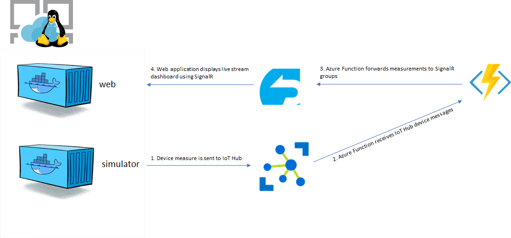
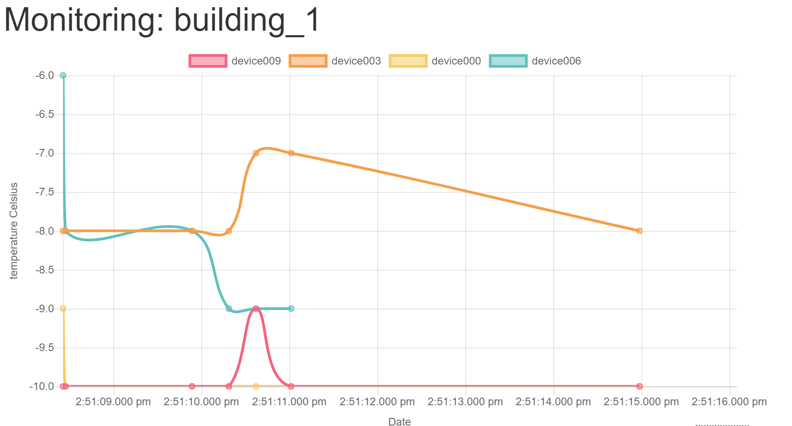

# Simple IoT Dashboard with SignalR

This sample application demonstrates the usage of SignalR and Azure Functions to create a simple Web Dashboard. The application looks like this:



## Application components

### Simulator

Containerized .NET Core console application that sends simulated data to an IoT Hub. It creates 10 devices if none exists. Next it sends 1 measure every 5 seconds per device until interrupted.

### Azure Function

Serverless function triggered by IoT Hub messages routing measurements to Azure SignalR based on the device's building. In order to send messages from the Azure Function to clients connected on the web application we have to REST API provided by the Azure SignalR Service.
This API is located at ```https://xyz.service.signalr.net:5002/api/v1-preview``` and the swagger definition is available [here](https://github.com/Azure/azure-signalr/blob/dev/docs/swagger.json). It uses JWT authentication.

To facilitate the comunication with the API I am using the custom Azure Function binding from my nuget package [https://www.nuget.org/packages/Fbeltrao.AzureFunctionExtensions](https://www.nuget.org/packages/Fbeltrao.AzureFunctionExtensions) that does all the dirty work needed to consume the API.

Calling it is encapsulated by a binding, like this:

```CSharp
/// <summary>
/// Http triggered function to broadcast to a SignalR hub
/// </summary>
/// <param name="req"></param>
/// <param name="message"></param>
/// <param name="log"></param>
/// <returns></returns>
[FunctionName(nameof(HttpTriggerBroadcastToHub))]
public static IActionResult HttpTriggerBroadcastToHub(
    [HttpTrigger(AuthorizationLevel.Function, "get", Route = null)] HttpRequest req,
    [SignalR(ServiceName = "%service_name%", AccessKey = "%access_key%")] out SignalRMessage message,
    TraceWriter log)
{
    message = new SignalRMessage()
    {
        Target = "broadcastMessage",
        Hub = "chat",
        Arguments = new object[] { $"Hub broadcast from function {nameof(HttpTriggerBroadcastToHub)}", $"Now it is {DateTime.Now}" }
    };

    return new OkResult();
}
```

## Web

The live dashboard is displayed by a containerized .NET Core Web application. Live data is obtained from SignalR and renderized at the client side using [Chart.js](https://www.chartjs.org). Users can choose which building they would like to monitor by switching the SignalR group they are part of with the following client side call:
```javascript
/// connection is the SignalR connection
connection.invoke('monitorBuilding', buildingId);
```

Which calls the following method on server side:
```C#
public class IoT : Hub
{
    ...
    [Authorize]
    public async Task MonitorBuilding(string name)
    {
        var expectedGroups = new HashSet<string>();
        var allGroups = new string[] { Build_1_Group_Name, Build_2_Group_Name, Build_3_Group_Name };
        foreach (var groupName in allGroups)
        {
            if (name == Build_All_GroupName || name == groupName)
                expectedGroups.Add(groupName);
        }


        var currentGroups = new HashSet<string>();
        if (this.Context.Items.TryGetValue(CurrentBuildingKey, out var currentGroupValue))
        {
            switch (currentGroupValue.ToString())
            {
                case Build_All_GroupName:
                    foreach (var g in allGroups)
                        currentGroups.Add(g);
                    break;

                default:
                    currentGroups.Add(currentGroupValue.ToString());
                    break;
            }
        }

        foreach (var groupToAbondon in currentGroups.Except(expectedGroups))
        {
            await Groups.RemoveFromGroupAsync(this.Context.ConnectionId, groupToAbondon);
        }

        foreach (var groupToJoin in expectedGroups.Except(currentGroups))
        {
            await Groups.AddToGroupAsync(this.Context.ConnectionId, groupToJoin);
        }
        
        this.Context.Items[CurrentBuildingKey] = name;
    }
    ...
}
```



## Deploying the sample application in Azure

In order to run this application in Azure we have to install the following resources:

1. Azure SignalR Service
1. IoT Hub
1. Azure Function (connected to IoT Hub and Azure SignalR Service)
1. The 2 containers (simulator and web). They can be deployed in multiple ways (ACI, AKS, Service Fabric and App Service). I will demonstrate how to deploy in multi-container workloads in Azure Web Apps.

### 1. Deploying the SignalR Service

To create the resource in Azure Portal search for "SignalR Service". The free tier should be enough to get started.

### 2. Deploying IoT Hub

Create an IoT Hub in Azure, select at least Basic 1 Tier, so we can have multiple IoT devices.

### 3. Deploying the Function

Git clone this repository and build the solution under ./IoTDashboardWithSignalR. Deploy the function **IoTDashboardWithSignalR.IoTHubPublisherFunction** to Azure from Visual Studio by right clicking the project and then selecting Publish. At the time of the writing we were using a beta version of Azure Functions. If prompted accept that we should be using a preview version.

Once deployed we need to configured the SignalR and IoT Hub information in our Azure Function. To do so go to the Azure Function Application settings and add the following keys:

**signalr_servicename**: set the name of your SignalR Service. This is the first part of the signalr host name. Example: if your service host name is ```mysignalr.service.signalr.net``` then enter ```mysignalr```

**signalr_accesskey**: enter here the SignalR service key, retrieved from the "Keys" blade in Azure Portal.

**IoT Hub**: This is a bit cubersome to find out. Go to your IoT Hub, under Endpoints select built-in endpoint "Events - messages/events". Copy the Event-Hub compatible endpoint.
Something like: Endpoint=sb://xxxxxxx.servicebus.windows.net/;SharedAccessKeyName=iothubowner;SharedAccessKey=xxxxxxx

The copy the value of Event Hub-compatible name property concatenating with ```;EntityPath=```

The final connection string looks like:
Endpoint=sb://```xyz```.servicebus.windows.net/;SharedAccessKeyName=iothubowner;SharedAccessKey=```xyz```;EntityPath=```xyz```

Save settings the Azure Function settings. Your function is ready to listen to IoT Hub and send measurements to SignalR. Let's finalize it!

### 4. Deploying the Simulator and Web application

Azure Web Apps supports deploying multi containers workloads with a docker-compose semantic. Only one of the containers can listen to incoming traffic (by exposing either port 80 or 8080). In this sample application we are going to deploy the backgroung worker that generates simulated IoT device data and the web application displaying the portal. For that create a new Web App. During the creation choose **Docker** as **OS**.

Once Docker has been selected you also need to configure the container. Choose **Docker Compose** and point to a local yml file containing the following:

```yml
version: '3'
services:
  web:
    image: fbeltrao/iotdashboardwithsignalrweb:1.2
    environment:
      ConnectionStrings__signalr: Endpoint=https://<enter-signalr-name>.service.signalr.net;AccessKey=<enter-signalr-access-key>
    ports:
      - "80:80"

  simulator:
    image: fbeltrao/iotdashboardwithsignalrsimulator:1.2
    environment:
      iothub: HostName=<enter-iot-hub>.azure-devices.net;SharedAccessKeyName=iothubowner;SharedAccessKey=<enter-iot-hub-key>
```

Replace the SignalR and IoT Hub connection strings with the values from your Azure subscription. After the deployment has been finalized your Azure Function should be receiving IoT Hub device messages and the Dashboard should be able to display measurements coming through SignalR.

**Tips**

1. The .NET Core application expects the connection string to be available in the appsettings.json file as 
```json
{
  "ConnectionStrings": {
    "signalr": ""
  }
}
```
or in environment variable ```ConnectionStrings:signalr```. Environment variables with colon don't work properly with Docker. You can use double underscores to replace the colon character as ```ConnectionStrings__signalr```

2. You might try to set envirnoment variables the following way
```
simulator:
    image: fbeltrao/iotdashboardwithsignalrsimulator:1.2
    environment:
      - iothub: HostName=<enter-iot-hub>.azure-devices.net;SharedAccessKeyName=iothubowner;SharedAccessKey=<enter-iot-hub-key>
```

It won't work for now. Use without hyphen. For more limitation check this [page](https://blogs.msdn.microsoft.com/appserviceteam/2018/05/07/multi-container/)

