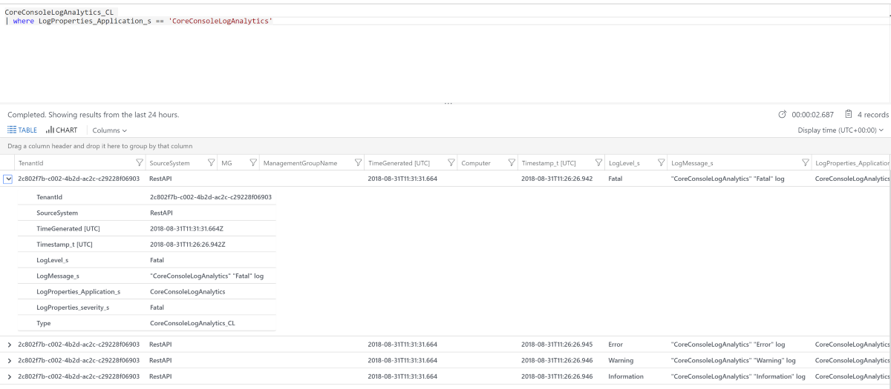

# Logging to Azure Log Analytics

Logging to Azure Log Analytics can be done using Serilog. It can take up to several minutes (or hours) before logged information shows up, be patient!

Quick Steps:
1. Add following nuget packages
```text
Serilog
Serilog.Settings.Configuration
Serilog.Sinks.AzureAnalytics
```

2. Setup logging
```c#
// Check here to find out how to get this information from LogAnalytics here https://www.systemcenterautomation.com/2018/05/find-azure-log-analytics-keys/
const string WORKSPACE_ID = "";
const string AUTHENTICATION_ID = "";


var logger = new LoggerConfiguration()
    .WriteTo.AzureAnalytics(WORKSPACE_ID, AUTHENTICATION_ID, new ConfigurationSettings
    {
        LogName = nameof(CoreConsoleLogAnalytics)
    })
    .CreateLogger();

```

3. Take advantage of semantic/structure logging
```C#
logger.Information("{Number}: {Application} {severity} log", 2, nameof(CoreConsoleLogAnalytics), "Information");
```

4. Log Analytics allows you to query semantic/structure information. For instance search for all 'Fatal' errors:
```sql
CoreConsoleLogAnalytics_CL 
| where LogProperties_Application_s == 'CoreConsoleLogAnalytics' 
```


In Log Analytics the data source will be {LogName}_CL (from Custom Log). The custom dimensions will be available as LogProperties_{CustomDimension}_{PropertyType s,t,...}


