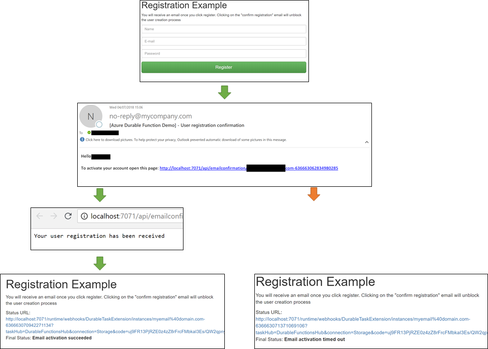
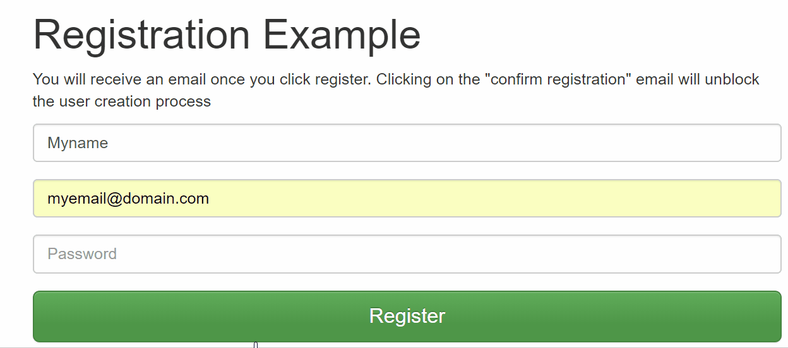
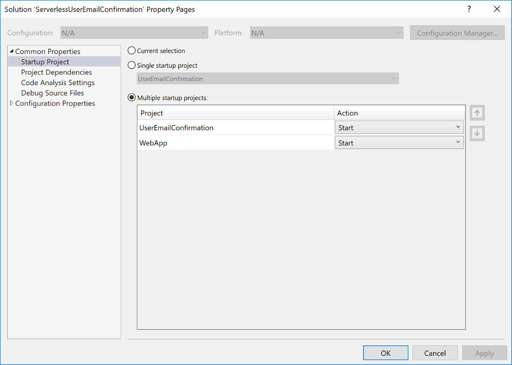

# User registration with email activitation with Azure Durable Functions

This repository demonstrates contains a sample implementation of a user registration process that requires email activation using Azure Durable Functions. If you need more information about Durable Function check the [documentation](https://docs.microsoft.com/en-us/azure/azure-functions/durable-functions-overview).




## Vanilla implementation

A traditional implementation of this feature involves the following steps:

1. Obtain user information
2. Stored user information with additional metadata ```{ emailActivationDone: false, emailActivationExpiration: 'now() + 30 minutes'}```
3. Send email containing link to "url to activate account"
4. On "url to activate account" handler update the account setting ```{ emailActivationDone: true }``` if account did not expire
5. Have a job that removes/disables all accounts ```where emailActivationDone == false AND emailActivationExpiration < getDate()``` 


## Durable Functions implementation

The Durable Function implementation shines because it can be deployed as a single unit. No scheduled jobs, no need to create users in status "waiting for email activation". This is all possible due to the concepts of timers and external events. This is how the implementation works:

1. Obtain user information
2. Start a new "UserRegistrationOrchestator" instance with the user information as input
3. Orchestrator send emails containing link to "url to activate account". Afterwards it creates 2 tasks. The first being a timer that will be raised according to the activation expiration. The second task that will wait for external event "EmailConfirmationReceived". The function will wake-up once one of the two task is triggered (first one wins)
4. Same Azure Function deployment acts as handler to "url to activate account", checking if the registration did not expired yet and, in case it is still valid, sends the event "EmailConfirmationReceived" to the orchestration instance
5. Orchestration instance wakes up. If the reason to wake is that the external event was received (user clicked on email link) we can go ahead and create the user in our database. Else, if the reason to wake is the timer, we consider this registration as expired. Since we only create the user once the activation succeeds we don't need a schedule job to handle all expire registration attempts

## Code in this repository

The solution included in this repository contains two projects:

- UserEmailConfirmation: is the Azure Durable Function implementing the email activation workflow
- WebApp: is a React application (hosted in a .NET core web app) that obtains the user information and starts the email activation workflow, polling the status to update the UI



### Orchestration implementation details

Workflow starts by receiving a POST @ /api/UserRegistration with following payload:
```json
{
    "name": "user name goes here",
    "email": "user email goes here",
    "password": "user password goes here"
}
```

#### Orchestration startup implementation

Input to orchestration instance contains the information of the user plus the base uri where the functions is running (in order to build the "activate user URL"). 

```C#
[FunctionName(nameof(UserRegistration))]
public static async Task<HttpResponseMessage> UserRegistration(
    [HttpTrigger(AuthorizationLevel.Anonymous, "post")]HttpRequestMessage req,
    [OrchestrationClient]DurableOrchestrationClient starter,
    TraceWriter log)
{
    try
    {
        var input = JsonConvert.DeserializeObject<UserRegistrationInput>(await req.Content.ReadAsStringAsync());
        if (input == null ||
            string.IsNullOrEmpty(input.Name) ||
            string.IsNullOrEmpty(input.Email)
            )
        {
            return new HttpResponseMessage(System.Net.HttpStatusCode.BadRequest) { Content = new StringContent("Invalid request payload") };
        }

        var baseUri = new StringBuilder()
            .Append(req.RequestUri.Scheme)
            .Append("://")
            .Append(req.RequestUri.Host);

        if (!req.RequestUri.IsDefaultPort)
            baseUri.Append(':').Append(req.RequestUri.Port);
        baseUri.Append("/api");

        input.BaseUri = baseUri.ToString();
        input.InstanceId = $"{input.Email}-{DateTime.UtcNow.Ticks}";

        // Instance Id will be <email address>-<current ticks>
        await starter.StartNewAsync(nameof(UserRegistrationOrchestration), input.InstanceId, input);

        log.Info($"Started orchestration with ID = '{input.InstanceId}'.");

        return starter.CreateCheckStatusResponse(req, input.InstanceId);
    }
    catch (Exception ex)
    {
        log.Error($"Error starting registration process", ex);
        return new HttpResponseMessage(System.Net.HttpStatusCode.InternalServerError) { Content = new StringContent("Internal error") };
    }
}
```

#### Workflow logic

Workflow starts by calling the activity SendConfirmationEmailActivity, which sends email using SendGrid services (there is a free tier for testing purposes). The emailing activity receives as input the user information plus the URL that should be called to activate the registration.

Once the email is sent two tasks are created: timer and external event. The first one to be triggered wins, defining whether or not the user registration succeeded.

```C#
[FunctionName(nameof(UserRegistrationOrchestration))]
public static async Task<bool> UserRegistrationOrchestration(
    [OrchestrationTrigger] DurableOrchestrationContext context)
{
    var input = context.GetInput<UserRegistrationInput>();

    // 1. Send confirmation email
    var sendConfirmationEmailInput = new SendConfirmationEmailInput
    {
        RegistrationConfirmationURL = $"{input.BaseUri}/emailconfirmation/{input.InstanceId}",
        Email = input.Email,
        Name = input.Name
    };

    await context.CallActivityAsync(nameof(SendConfirmationEmailActivity), sendConfirmationEmailInput);

    // 2. Setup timer and wait for external event to be executed. Whatever comes first continues            
    using (var cts = new CancellationTokenSource())
    {
        var expiredAt = context.CurrentUtcDateTime.Add(TimeSpan.FromSeconds(30));
        var customStatus = new UserRegistrationOrchestatorStatus { Text = "Waiting for email confirmation", ExpireAt = expiredAt };
#if DEBUG
        // only send the confirmation URL back in debug mode
        customStatus.RegistrationConfirmationURL = sendConfirmationEmailInput.RegistrationConfirmationURL;
#endif
        context.SetCustomStatus(customStatus);

        var confirmationButtonClicked = context.WaitForExternalEvent<bool>("EmailConfirmationReceived");
        var timeout = context.CreateTimer(expiredAt, cts.Token);

        var winner = await Task.WhenAny(confirmationButtonClicked, timeout);

        // Cancel the timer if it has not yet been completed
        if (!timeout.IsCompleted)
            cts.Cancel();

        if (winner == confirmationButtonClicked)
        {
            // TODO: add here logic to actually create the user in your database
            context.SetCustomStatus(new UserRegistrationOrchestatorStatus { Text = "Email activation succeeded" });                    
            return true;
        }
        else
        {
            context.SetCustomStatus(new UserRegistrationOrchestatorStatus { Text = "Email activation timed out" });
            return false;
        }
    }                         
}
```

#### Handling the activate account link click

Once the activate link is clicked a look up in the workflow instance is done, ensuring that it is valid and not yet expired. If all conditions are met the event "EmailConfirmationReceived" is sent, triggering the orchestration to be finished. 

Durable functions have a built-in URL to send events to an orchestration instance (i.e. http://domain/runtime/webhooks/DurableTaskExtension/instances/myemail%40domain.com-636663105536876340/raiseEvent/{eventName}?taskHub=DurableFunctionsHub&connection=Storage&code=uj9FR13PjRZE0z4zZ8rFrcFMbkaI3Es/QW2qpnykkxi/Uy8GCvYXYg=="). The reason I have built a custom URL is to be able to add additional checks and return a message indicating whether or not the user activation is still valid.

```C#
/// <summary>
/// Handles the Email link to confirm the user registration
/// </summary>
/// <param name="client"></param>
/// <param name="instanceId"></param>
/// <returns></returns>        
[FunctionName(nameof(EmailConfirmationHandler))]         
public static async Task<HttpResponseMessage> EmailConfirmationHandler(
    [HttpTrigger(AuthorizationLevel.Anonymous, "get", Route = "emailconfirmation/{instanceId}")] HttpRequestMessage req,
    [OrchestrationClient]DurableOrchestrationClient client, 
    string instanceId,
    TraceWriter log)
{
    var instanceStatus = await client.GetStatusAsync(instanceId);
    if (instanceStatus?.RuntimeStatus == OrchestrationRuntimeStatus.Running)
    {
        if (instanceStatus.CustomStatus != null)
        {
            var status = instanceStatus.CustomStatus.ToObject<UserRegistrationOrchestatorStatus>();
            if (status.ExpireAt.HasValue &&
                status.ExpireAt.Value < DateTime.UtcNow)
            {
                return new HttpResponseMessage(System.Net.HttpStatusCode.OK)
                {
                    Content = new StringContent($"Registration confirmation expired {DateTime.UtcNow.Subtract(status.ExpireAt.Value).TotalSeconds} seconds ago")
                };
            }
        }

        await client.RaiseEventAsync(instanceId, "EmailConfirmationReceived", true);

        return new HttpResponseMessage(System.Net.HttpStatusCode.OK)
        {
            Content = new StringContent("Your user registration has been received")
        };
    }
    else
    {
        return new HttpResponseMessage(System.Net.HttpStatusCode.OK)
        {
            Content = new StringContent("Registration confirmation is not valid")
        };
    }
}
```


## Testing the solution

The solution can be tested locally. You need a [SendGrid account](https://docs.microsoft.com/en-us/azure/sendgrid-dotnet-how-to-send-email#create-a-sendgrid-account) to send emails (the free version is enough). 

Copy your SendGrid API key to the local.settings.json file:
```json
{
  "IsEncrypted": false,
  "Values": {
    "AzureWebJobsStorage": "UseDevelopmentStorage=true",
    "AzureWebJobsDashboard": "UseDevelopmentStorage=true",
    "FUNCTIONS_WORKER_RUNTIME": "dotnet",
    "sendGridApiKey": "set your SendGrid key here"
  },
  "Host": {
    "LocalHttpPort": 7071,
    "CORS": "*"
  }
}
```


To debug both projects at once using Visual Studio right click on the Solution, click properties and setup multiple startup projects as the screenshot below: 


